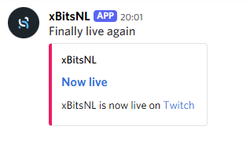

# discord_embeds
Discord embedded messages for Streamer.Bot

Create a folder inside your Streamer.Bot/data folder called `scripts`. Download discord-webhook.js to that folder.

%embed_description% can contain `\n` as a newline. 